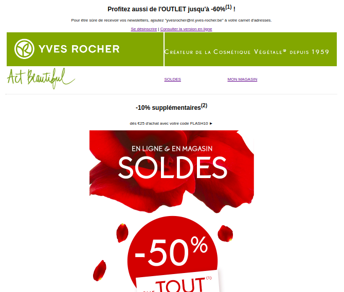

# Une newsletter de qualité !

Voici ma première newsletter ! faite dans les règles de l'art!... et les pires contraintes :(

## un (petit) projet de standardisation 

bon, qu'on se le dise , les newsletters , ce n'est pas le plus compliqué , ni le plus passionnant.
pourtant , on ne peut nier son importance, que ce soit pour la communication des entreprises où pour le confort des utilisateurs.

N'hésitez pas à aller jetter un coup d'oeuil !

